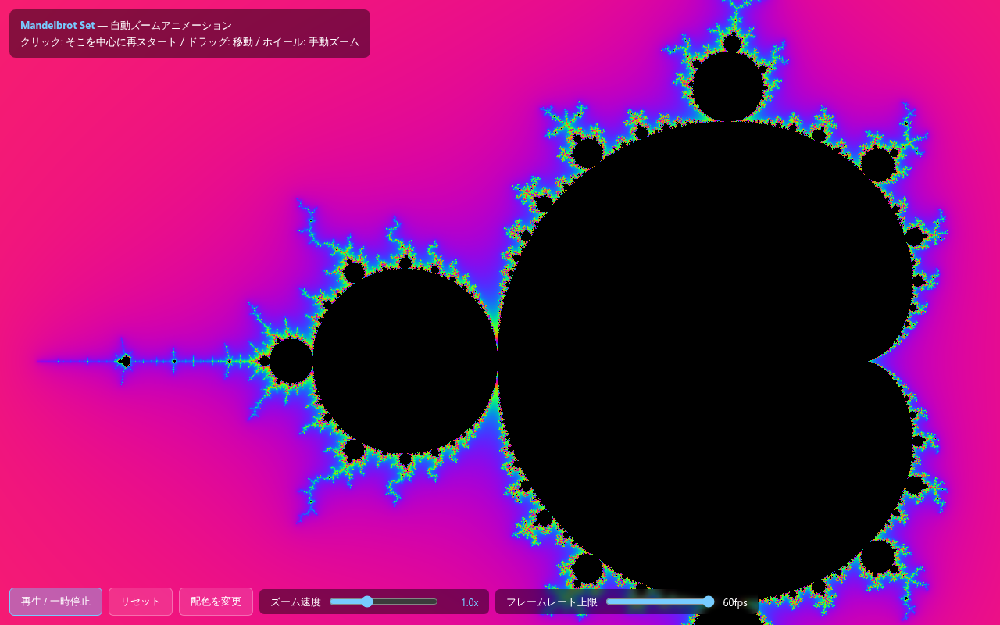

# Mandelbrot Set Animation

WebGL(フラグメントシェーダ)でマンデルブロ集合をリアルタイム計算・描画する、自動ズームアニメーションの単一HTMLアプリ。

**デモ**: https://mandelbrot-set-animation.vercel.app



## 主な機能

- ページを開くと、マンデルブロ集合のある一点(シーホースバレー付近)を中心に自動でズームインし続けるアニメーションが再生される
- 十分深くズームすると数値精度の限界に達し、自動的に初期スケールへリセットしてループする
- クリックでその地点を新しい中心として再スタート、ドラッグで表示位置を移動、マウスホイールで手動ズーム
- 「再生 / 一時停止」「リセット」ボタン、配色(クラシック・炎・氷の3種)を切り替える「配色を変更」ボタン
- ズーム速度(0〜3.0x)とフレームレート上限(5〜60fps)をスライダーで調整可能

## 技術スタック

- 依存ライブラリなし、ビルド不要の単一HTMLファイル(`index.html`)
- 描画はWebGL 1.0のフラグメントシェーダで実装(GLSL、smooth iteration countによる連続的な配色)

## 設計上の判断: 無限ズームについて

数学的にはマンデルブロ集合は無限に拡大可能だが、本デモでは意図的に無限ズームを実装していない。任意精度演算(perturbation theory等)を用いれば技術的には可能だが、実装が極めて複雑になり、仮に不具合が混入した場合、描画しているものが数学的に正しいか判断する手段がなくなる可能性が高いと考えた。現状のシンプルな実装でもマンデルブロ集合のフラクタル性は十分に体感できると考え、実装を見送っている。

## セットアップ

前提: モダンブラウザ(WebGL対応)のみ。ビルドやインストールは不要。

```bash
open index.html   # またはブラウザで直接開く
```

任意の静的サーバーで配信してもよい。

```bash
npx serve .
```

## 使い方

1. `index.html` をブラウザで開くと、自動ズームアニメーションが始まる
2. 気になる場所をクリックすると、その地点を中心に再スタートする
3. ドラッグで表示位置を移動、ホイールで手動ズームできる
4. 画面下部のボタン・スライダーで再生/一時停止、リセット、配色、ズーム速度、フレームレート上限を操作できる

## License

MIT License. See [LICENSE](LICENSE) for details.
